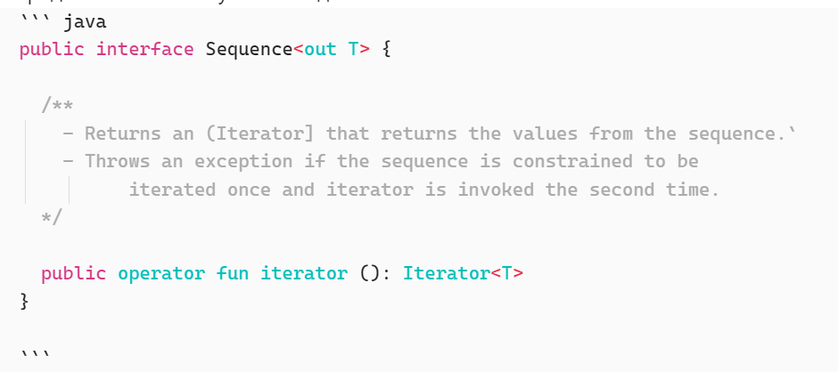

Данные заметки предназаначены для помощи в публикации материалов Obsidian через движок Hugo

# Работа с Hugo

## Как собрать сайт

0. Перейти в директорию build-site
1. Определить переменные
   MacOS:
      export HUGO_PATH=../../../HUGO/hugo_0.150.0_darwin-universal/
      export VAULT_PATH=~/Yandex.Disk.localized/Sync.\ Projects/Obsidian.Notes/Я.Практикум/
   Windows:
      export VAULT_PATH=../../../YandexDisk/Sync.\ Projects/Obsidian.Notes/Я.Практикум/
2. Проверить сайт с помощью команды server с ключами `--contentDir`, `--cleanDestinationDir` и `--destination ../docs`
   MacOS:
      $HUGO_PATH/hugo server  --contentDir $VAULT_PATH --cleanDestinationDir --destination ../docs
   Windows:
      hugo server  --contentDir ../../../YandexDisk/Sync.\ Projects/Obsidian.Notes/Я.Практикум/ --cleanDestinationDir --destination ../docs
      
3. Собрать сайт с помощью команды build
   $HUGO_PATH/hugo build  --contentDir $VAULT_PATH --cleanDestinationDir --destination ../docs
4. Закоммитить изменения (Commit message: "Update Site (202X-XX-XX-X)", вместо XX - подставить дату и номер коммита)
5. Проверить через [сайт](https://tech-notizen-inno.github.io/) 

### Render 
1. render-image.html - создает абсолютную ссылку в виде /00-images/XXXXX
2. render-link.html - создает абсолютные ссылки для (pdf) -> 00-resource, (txt, yml, conf) -> (00-sample) 

## Просмотр сайта
Локальный просмотр сайта при запущенном hugo `hugo server` [открыть](http://localhost:1313)

# Работа с Markdown

### Настройка Obsidian
1. Убрать WikiLinks (при этом можно будет пользоваться [[, которые будут трансформироваться в Markdown Link) `Settigs -> File and Links -> Wikilings = OFF`
2. Установить плагин Wikilinks to MDLinks (P1)
3. Установить плагин TextFormat (P2)
4. Установить плагин Regexp Find/Replase (P3)
5. Настроить Settings/File and Links/Attachment folder Path = 00-images

### Работа с сылками на другие страницы
1. Набрать [[ - для поиска нужно страницы
2. Внести страницу, сформируется обычная ссылка
3. Добавить отображаемое название ссылки ( ref "TITLE" )

Пример
`[Общий обзор языка Kotlin](Технологии.%20Язык%20Kotlin.md )`

[Hugo Docs](https://gohugo.io/render-hooks/images/)

### Меню

1. Настраивается на config.toml через params.BookSection задается верхний уровень меню ('*' - корень сайта)
2. Для создания схлопывающейся папки меню в директорию нужно добавить _index.md c опцией bookCollapseSection: true
3. Для регулирования последовательности элементов в папке меню нужно использовать свойста weight: 20
4. Чтобы страница не выводилась в меню в свойства нужно добавить bookHidden: true

### Работа с картинками
1. Hotkey для Wikilinks to MDLinks (P1) - Ctrl+Shift+L - конвертация ссылок из одного формата в другой
2. Стереть название файла из квадратных скобок. Можно использовать Regexp (P3)  `\!\[.*\]` заменить на `![]` 

1. Выбрать для TextFormat (Ctrl+P) - Text Format: Convert WikiLinks to plain MD links in selection
2. Убрать названия файлов
3. заменить png.md -> png
4. Удалить все пробелы в именах файлов - %20

Пример

``

### Работа с якорями


### Работа с ресурсами (PDF)
1. Набрать [[ - для поиска нужно страницы
2. Внести страницу, сформируется обычная ссылка
3. Доработать ссылку, чтобы она была абсолютной и начиналась с /_resources или с /_samples (ВАЖНО. Сейчас это сделает для ряда расширеней сам renderer)

Пример
`[Базовые элементы Kotlin](/_resources/202505_OK_M1L2_basic-250160-c1055f.pdf)`


### Работа с блоками кода
1. Блоки кода (несколько строк), нужно выделять тройным символом ````

Пример


# Полезные ссылки
[Все настройки Hugo](https://gohugo.io/configuration/all/#ignorefiles)
[Страница с темой hugo book](https://hugo-book-demo.netlify.app/docs/example/)